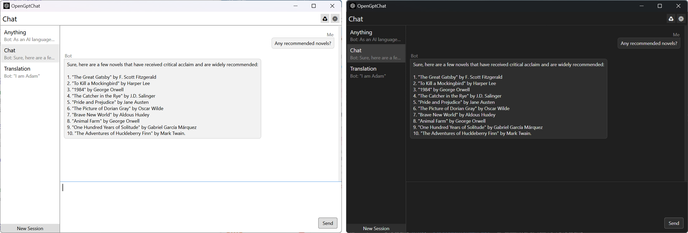

# OpenGptChat 

    /  

A simple chat client based on [Open AI Chat completion API](https://platform.openai.com/docs/guides/chat).

## Features

1. Real-time response. By using HTTP Stream, the program can display every character on the screen as soon as the server responds, without waiting for the entire response to complete.
2. Multiple sessions. You can create multiple sessions on the left side of the program, each with its own chat content, which are independent of each other and can be switched freely.
3. Multiple languages. When you first start the program, it will detect your system language. If it is a supported language, the program will automatically switch to the corresponding language. You can also manually switch in the settings.
4. Hot updates. The configuration information you change in the settings page will take effect immediately in the program, without the need to save the configuration and restart the program, including the "always on top" option and language settings.
5. Hotkeys. As a convenient tool, OpenGptChat provides hotkeys for hiding and restoring. They are respectively "Ctrl+H" and "Ctrl+Shift+H". You can invoke the program anywhere.

## Instructions

1. Download the latest version in "Releases".
2. Create a folder and move "OpenGptChat.exe" into it.
3. Open "OpenGptChat.exe", it will automatically generate the configuration and database files in the same location.
4. Go to the settings page and set your own "API Key", or you can also customize the "System Message".
5. Sit back, relax, and enjoy the fun brought by "OpenGptChat"!

> Tip: You can use "Ctrl + Enter" to send messages in the text box.

## What is API Key

The OpenAI API uses API keys for authentication. Visit your [API Keys](https://platform.openai.com/account/api-keys) page to retrieve the API key you'll use in your requests. Usually, the API key is a secret and do not share it with others.

## What you can learn?

1. Learn **Binding**, **Command**, **Template**, **Style**, **Trigger**, **Animation** in WPF.
2. Use `LiteDB` to save data without SQL.
3. Use `CommunityToolkit.Mvvm` in WPF project.
4. Use `Microsoft.Extensions.Hosting` for DependencyInjection, Configuration.
5. Use `Hardcodet.NotifyIcon.Wpf` to create a notify icon in WPF applciation.
6. Use `Microsoft.Xaml.Behaviors.Wpf` to add more operation functions in WPF application.
7. Use `EleCho.GlobalHotkey.Windows.Wpf` to handle global hotkey in WPF applciation.
