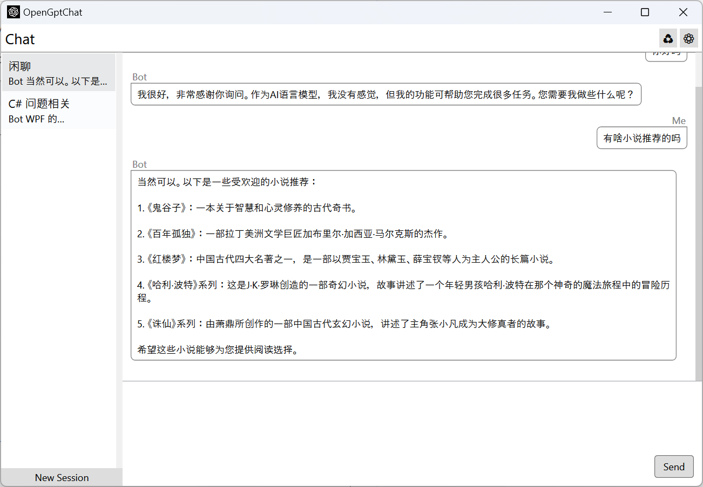

# OpenGptChat 

   /  

基于 [Open AI Chat API](https://platform.openai.com/docs/guides/chat) 的简易聊天客户端

## 使用方法

1. 下载最新的版本
2. 打开 `OpenGptChat.exe`
3. 转到配置页面并设置自己的API密钥
4. 坐和放宽, 享受 `OpenGptChat` 带来的乐趣罢!

> 小提示：您可以在文本框中使用 `Ctrl + Enter` 发送消息。

## 什么是 API 密钥

OpenAI API 使用API密钥进行身份验证。请前往您的[API 密钥](https://platform.openai.com/account/api-keys)页面检索您在请求中会使用的 API 密钥。通常情况下，API 密钥是秘密的，不应与他人共享。

## 您可以学到什么？

1. 学习 WPF 中的 **Binding**、**Command**、**Template**、**Style**、**Trigger**、**Animation**
2. 在 WPF 项目中使用 `CommunityToolkit.Mvvm`
3. 使用 `Microsoft.Extensions.Hosting` 进行依赖注入和配置
