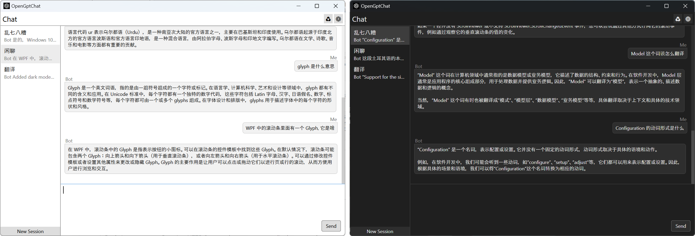

# OpenGptChat 

   /  

基於 [Open AI Chat API](https://platform.openai.com/docs/guides/chat) 的簡易聊天客戶端

## 功能

1. 實時響應。通過使用`HTTP Stream`，在伺服器響應每一個字的時候，程式都能將它展示到螢幕上，而無需等待整個響應完成。
2. 多會話。你可以在程式左側創建多個會話，每一個會話都有獨立的聊天內容，它們是互不干擾的，你可以隨意切換。
3. 多語言。第一次啟動時，程式會檢測你的系統語言，如果是支援的語言，程式會自動切換至對應語言，你也可以在配置中手動切換。
4. 熱更新。你在配置頁面更改的配置資訊，都會立即在程式中生效，而無需你保存配置並重啟程式，包括置頂選項與語言設置。
5. 熱鍵。作為一個便捷的工具，OpenGptChat 提供了隱藏與還原的熱鍵，它們分別是`Ctrl+H` 以及 `Ctrl+Shift+H`，你可以在任何地方喚起程式。

## 使用方法

1. 在`Releases`中下載最新的版本。
2. 創建一個資料夾，並將`OpenGptChat.exe`移動到資料夾內。
3. 打開`OpenGptChat.exe`，它會自動在所在位置生成配置檔案及資料庫檔案。
4. 轉到配置頁面並設置自己的`API 密鑰`，或者也可以自定義`系統消息`。
5. 坐和放鬆，享受`OpenGptChat`帶來的樂趣罷！

> 小提示：您可以在文字框中使用`Ctrl + Enter`發送消息。

## 什麼是 API 金鑰

OpenAI API 使用 API 金鑰進行身分驗證。請前往您的[API 金鑰](https://platform.openai.com/account/api-keys)頁面檢索您在請求中會使用的 API 金鑰。通常情況下，API 金鑰是秘密的，不應與他人分享。

## 您可以學到什麼？

1. 學習 WPF 中的 **Binding**、**Command**、**Template**、**Style**、**Trigger**、**Animation**
2. 使用 `LiteDB` 保存資料而無需撰寫 SQL 語句。
3. 使用 `CommunityToolkit.Mvvm` 以便捷實現可繫結數據與命令。
4. 使用 `Microsoft.Extensions.Hosting` 進行服務管理、配置與依賴注入。
5. 使用 `Hardcodet.NotifyIcon.Wpf` 在 WPF 程式中建立通知圖示。
6. 使用 `Microsoft.Xaml.Behaviors.Wpf` 在 WPF 程式中添加更多操作方式。
7. 使用 `EleCho.GlobalHotkey.Windows.Wpf` 在 WPF 程式中處理全域熱鍵。