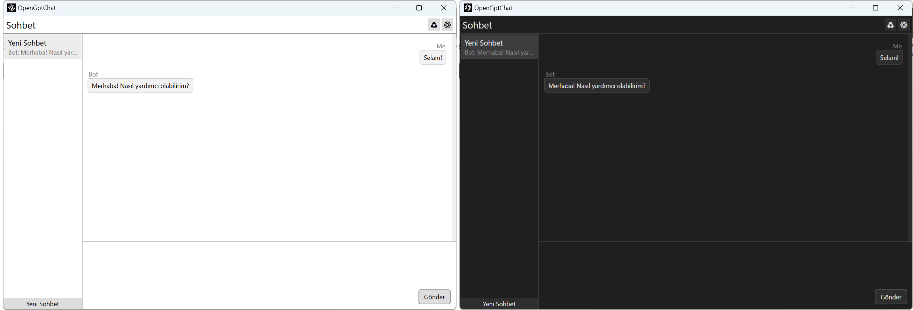

# OpenGptChat 

knnuznr tarafından Türkçeleştirilmiştir.

    /  

 
ChatGPT'ye dayalı basit bir sohbet uygulaması (https://platform.openai.com/docs/guides/chat).

## Özellikler

1. Anında yanıt. HTTP akışını kullanarak program, yanıtın tamamının tamamlanmasını beklemeden, sunucu yanıt verir vermez ekrandaki her karakteri görüntüleyebilir.
2. Birden fazla sohbet. Programın sol tarafında, her biri kendi sohbet içeriğine sahip, birbirinden bağımsız ve serbestçe değiştirilebilen birden fazla oturum oluşturabilirsiniz.
3. Birden fazla dil desteği. Programı ilk başlattığınızda, sistem dilinizi algılar. Desteklenen bir dil ise, program otomatik olarak ilgili dile geçecektir. Ayarlarda manuel olarak da geçiş yapabilirsiniz.
4. Anlık Güncellemeler. Ayarlar sayfasında değiştirdiğiniz yapılandırma bilgileri, "her zaman üstte" seçeneği ve dil ayarları da dahil olmak üzere yapılandırmayı kaydetmeye ve programı yeniden başlatmaya gerek kalmadan programda hemen etkili olacaktır.
5. Kısayollar. Kullanışlı bir araç olarak OpenGptChat, gizlemek ve geri yüklemek için kısayol tuşları sağlar. Sırasıyla "Ctrl + H" ve "Ctrl + Shift + H" dir.

## Kurulum

1. "Releases" sekmesinden son sürümü indirin.
2. Bir dosya oluşturun ve "OpenGptChat.exe" dosyasını oluşturduğunuz dosyaya yerleştirin.
3. Yerleştirdiğiniz dosyayı açın, otomatik olarak konfigürasyon ve veri tabanı dosyalarını aynı dosyaya oluşturacaktır.
4. Ayarlar sekmesine gidin ve kendi API Anahtarınızı yerleştirin.
5. Arkanıza yaslanın ve OpenGptChat'in keyfini çıkartın!

> Biliyor muydunuz? Mesajınızı göndermek için "Ctrl + Enter" tuş kombinasyonunu kullanabilirsiniz!

## API Key nedir?

OpenAI API, kimlik doğrulama için API anahtarlarını kullanır. İsteklerinizde kullanacağınız API anahtarını almak için [API Keys](https://platform.openai.com/account/api-keys) sayfasına gidin ve API anahtarınızı oluşturun, oluşturduğunuz API anahtarını kimseyle paylaşmamanız önerilir.

## Ne öğrenebilirsiniz?

1. WPF'de **Binding**, **Command**, **Template**, **Style**, **Trigger**, **Animation** özelliklerini.
2. `LiteDB` ile SQL dosyası olmadan veri kaydetmeyi.
3. `CommunityToolkit.Mvvm` kullanmayı ve özelliklerini.
4. `Microsoft.Extensions.Hosting` DependencyInjection ve Konfigürasyon özelliklerini.
5. `Hardcodet.NotifyIcon.Wpf` WPF uygulamasına bildirim ikonu oluşturmayı.
6. `Microsoft.Xaml.Behaviors.Wpf` WPF uygulamasına daha fazla fonksiyon eklemeyi.
7. `EleCho.GlobalHotkey.Windows.Wpf` WPF uygulamasına kısayol eklemeyi.
